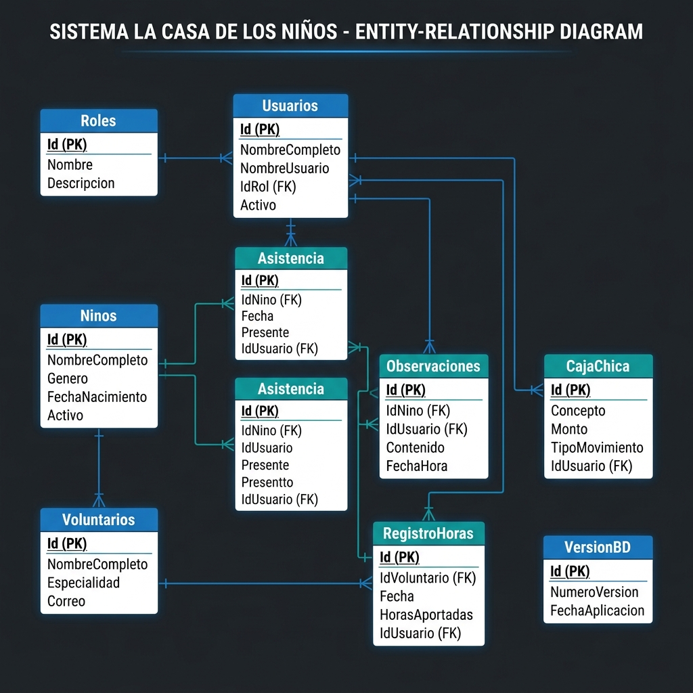

# Esquema Relacional — Sistema La Casa de los Niños

Este documento detalla el diseño de la base de datos local (SQLite) utilizada por el sistema.

## Estructura de Tablas

### 1. VersionBD
Lleva el control de las migraciones del esquema.
- **Id**: Identificador único.
- **NumeroVersion**: Texto (ej: "1.0.0").
- **FechaAplicacion**: Fecha y hora en que se aplicó el cambio.
- **Descripcion**: Detalle de los cambios realizados.

### 2. Roles
Define los niveles de acceso.
- **Id**: Identificador único.
- **Nombre**: "Administrador" o "Funcionario".
- **Descripcion**: Detalle de los permisos.

### 3. Usuarios
Personal que opera el sistema.
- **Id**: Identificador único.
- **NombreCompleto**: Nombre del funcionario.
- **NombreUsuario**: Credencial de acceso única.
- **ContrasenaHash**: Clave protegida con BCrypt.
- **IdRol**: Vínculo con la tabla Roles.

### 4. Ninos
Catálogo de beneficiarios.
- **Id**: Identificador único.
- **NombreCompleto**: Nombre del niño/a.
- **Genero / FechaNacimiento**: Datos demográficos.
- **Activo**: Borrado lógico (0: Inactivo, 1: Activo).

### 5. Asistencia
Registro diario de asistencia.
- **IdNino**: Vínculo con Ninos.
- **Fecha**: Fecha del registro.
- **Presente**: Booleano.
- **IdUsuario**: Quién realizó el registro.

### 6. Observaciones
Notas cualitativas de seguimiento.
- **IdNino**: Vínculo con Ninos.
- **Contenido**: Texto de la observación.
- **IdUsuario**: Quién escribió la nota.

### 7. Voluntarios y RegistroHoras
Gestión de apoyo externo y horas aportadas.

### 8. CajaChica
Control financiero básico (Ingresos/Egresos).

---
*Documentación generada automáticamente — Última actualización: 2026-04-10*
